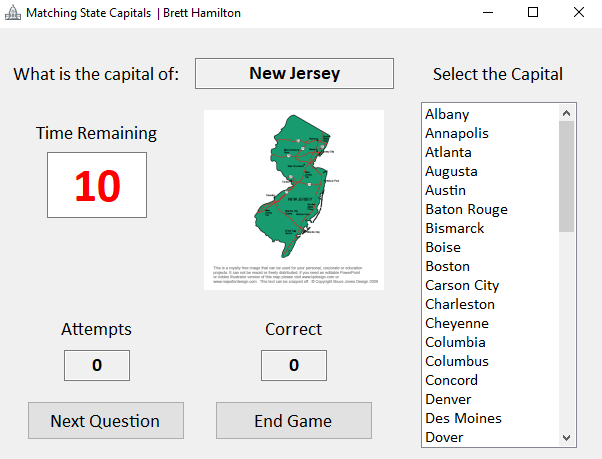

# State Capital Matching Game
Developed for a course project in a Data Structures course

## About
This matching game challenges players to match the correct state capitals to the corresponding U.S. states. Players have 20 seconds to select the correct capital from the scoll box list of capitals. The game features state images the correspond with the question, the number of attempts/correct answers made, and a percentage score at the end. The purpose of this project is to demonstrate use of associated container data structures, such as SortedDictionary.

## Demo Images

